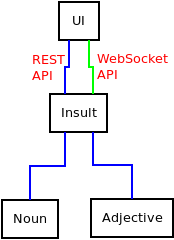
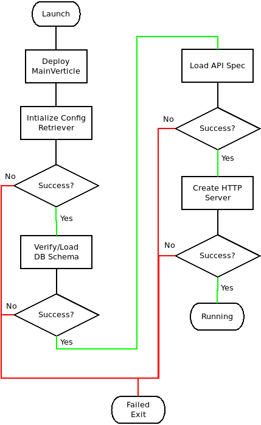

# Vert.x Microservices & Kubernetes

## Vert.x
> Eclipse Vert.x is a tool-kit for building reactive applications on the JVM

What does that mean?

* Messaging
* Non-Blocking APIs
* Clustering
* Simplified Concurrency

Why would I want to use Vert.x?

* Fast
  * Ranks highly on [TechEmpower Benchmarks](https://www.techempower.com/benchmarks/)
* Lightweight
  * Core Vert.x requires less memory than NodeJS/Express
* Multithreaded
  * Unlike some other non-blocking platforms, Vert.x can take advantage of all processor cores
* Polyglot
  * Vert.x applications can be written in a number of languages, and can even mix and match several languages in a single project
* Scalable
  * Clustering is available with little or no effort for Developers/Operations
* Unopinionated
  * It's JUST a library, you can use it in ANY Java application

## Vert.x Resources
* [Documentation](http://vertx.io/)
* [Tutorial](https://vertx.io/docs/guide-for-java-devs/)
* [Tutorial](https://developers.redhat.com/promotions/building-reactive-microservices-in-java/)
* [Vert.x Awesome](https://github.com/vert-x3/vertx-awesome/)

## Microservices Overview
This application consists of 3 microservices and a VueJS frontend. 

* Adjective Service - Provides era-appopriate derrogative adjectives
* Noun Service - Provides era-appropriate derrogative nouns
* Insult Service - Pulls adjective and nouns from the other services to build a complete insult
  * Also implements circuit-breakers to prevent broken services from seriously impacting the application
* VueJS Reactive UI

The diagram below shows the logical architecture of the system:



And the start-up flow for the Adjective and Noun services is diagrammed as well:



## Running This Project Locally

### Prerequisites
* Java 8
* Apache Maven >= 3.5.0
* Git
* [OpenShift Command Line Tools](https://github.com/openshift/origin/releases) (Optional)
* [MiniShift](https://github.com/minishift/minishift/releases) (Optional)
* [OpenShift](https://github.com/openshift/origin) (Optional)
* [VirtualBox](http://www.virtualbox.org) (On Windows/MacOS)

### Launching The Application In "Development" Mode
> The Maven Vert.x Plugin allows you to run the application in a mode where any changes to the code
> will cause a recompile and redeploy automatically. This allows you to do quick near-realtime 
> development work
```
git clone https://github.com/rhoar-shootout/rhoar-vertx.git
mvn -T 5 clean compile vertx:run
```

### Launching The Application Using MiniShift
* On Linux
```
oc cluster up
oc login -u developer -p developer https://localhost:8443/
mvn compile package vertx:package fabric8:deploy
```
* On MacOS/Windows
```
minishift start --vm-driver=virtualbox
oc login -u developer -p developer https://
mvn compile package vertx:package fabric8:deploy
```

### Deploying And Managing On OpenShift
The OpenShift deployment includes a complete CI/CD pipeline implementation using:
* Jenkins
* SonarQube
* Sonatype Nexus
* OWASP Zed Attack Proxy
* OWASP Dependency Check

```
git clone https://github.com/rhoar-shootout/rhoar-vertx.git
cd rhoar-vertx
git checkout ci-cd
oc login <Your OpenShift Cluster Master>
./run.sh
```

> You COULD potentially deploy the full CI/CD pipeline on MiniShift if you have 
> a sufficiently powerful computer, but realize that this deployment usually
> takes up enough resources for a server-grade system